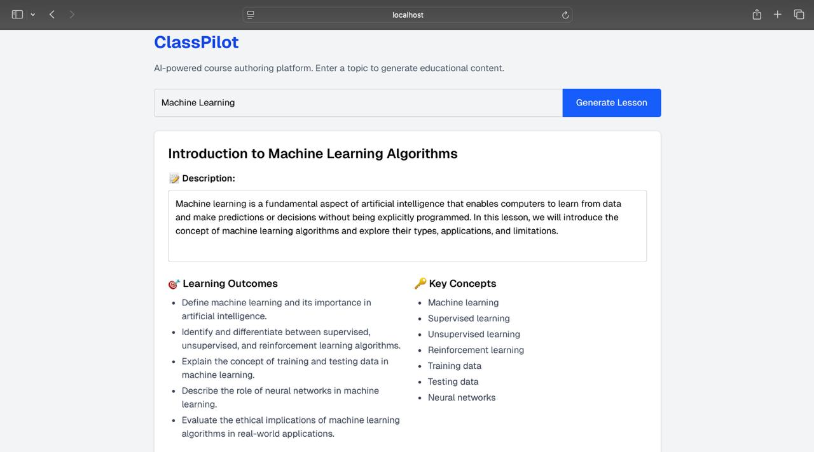
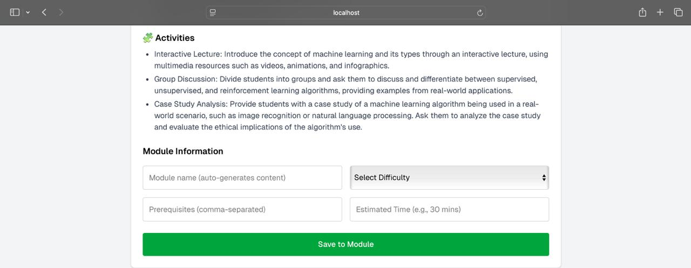
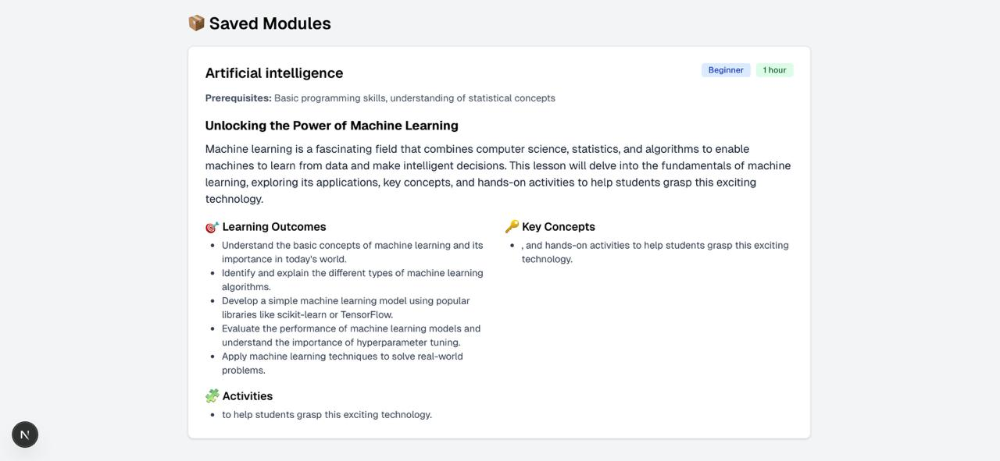

# 📘 ClassPilot

**ClassPilot** is an AI-powered course authoring tool that helps you quickly generate structured, high-quality educational modules based on a topic you provide. It’s designed for educators, content creators, and curriculum designers looking to save time while maintaining quality.

## 🚀 Features

- ✨ **Generate Lessons Instantly**  
  Just type in a topic and get a complete lesson with title, description, learning outcomes, key concepts, and activities.

- 🔍 **Smart Module Suggestions**  
  Automatically generates module names, difficulty levels, prerequisites, and estimated time for your lessons.

- 📝 **Rich Text Editing**  
  Use an intuitive editor to customize the lesson description as needed.

- 💾 **Save Lessons into Modules**  
  Organize your content into modules and view all saved lessons with detailed metadata.

- ⚡ **Powered by LLaMA-2 via Replicate API**  
  Uses advanced large language models to generate accurate and structured educational content.

## 🛠 Tech Stack

- **Frontend:** React (Next.js 15), Tailwind CSS, Tiptap Editor  
- **Backend:** Next.js API routes  
- **AI:** Replicate API (LLaMA 2 - 70B Chat Model)

## 🧪 How It Works

1. Enter a topic (e.g., "DBMS", "Machine Learning").
2. The app fetches a fully structured lesson from the AI.
3. You can review, edit the description, and see auto-suggested metadata.
4. Save the lesson as a module.
5. View all your saved modules with clean, organized structure.

## 📸 Screenshots

### 🔹 Lesson Generated


### 🔹 Lesson Generated


### 🔹 Saved Modules View



## 📦 Installation

```bash
git clone https://github.com/your-username/ClassPilot.git
cd ClassPilot
npm install
